# ER图可视化

## Mermaid ER图

```mermaid
erDiagram
    county ||--o{ county_nature : "has"
    county ||--o| poverty_counties : "may_be"
    county ||--o{ county_economy : "has_many_years"
    county ||--o{ county_agriculture : "has_many_years"
    county ||--o{ county_population : "has_many_years"
    county ||--o{ county_healthcare : "has_many_years"
    county ||--o{ transport_post : "has_many_years"
    county ||--o{ financial_services : "has_many_years"
    county ||--o{ agricultural_output : "produces"
    county ||--o{ crop_area : "grows"
    county ||--o{ finance_budget : "has"
    county ||--o{ surveyors : "assigned_to"
    county ||--o{ interviews : "has"
    surveyors ||--o{ interviews : "conducts"

    county {
        char CountyCode PK
        varchar CountyName
        varchar Province
        varchar City
        decimal Longitude
        decimal Latitude
        decimal LandArea
        int TownshipCount
        int VillageCount
    }

    county_nature {
        char CountyCode PK,FK
        tinyint RegionLevel
        decimal TerrainRelief
        decimal Longitude
        decimal Latitude
    }

    county_economy {
        char CountyCode PK,FK
        int Year PK
        decimal GDP
        decimal GDP_Primary
        decimal GDP_Secondary
        decimal GDP_Tertiary
        decimal PerCapitaGDP
        decimal RuralDisposableIncome
        decimal FiscalRevenue
        decimal FiscalExpenditure
    }

    county_agriculture {
        char CountyCode PK,FK
        int Year PK
        decimal CropArea
        decimal GrainOutput
        decimal MeatOutput
        decimal AgriOutputValue
    }

    county_population {
        char CountyCode PK,FK
        int Year PK
        decimal RegisteredPopulation
        int PrimarySchoolTeachers
        int MiddleSchoolTeachers
    }

    county_healthcare {
        char CountyCode PK,FK
        int Year PK
        int HospitalBeds
        int MedicalPersonnel
    }

    poverty_counties {
        char CountyCode PK,FK
        varchar CountyName
        varchar Region
        int ExitYear
    }

    agricultural_output {
        char CountyCode PK,FK
        int Year PK
        varchar ProductType PK
        decimal Output
    }

    crop_area {
        char CountyCode PK,FK
        int Year PK
        varchar CropType PK
        decimal SownArea
    }

    finance_budget {
        char CountyCode PK,FK
        int Year PK
        varchar Project PK
        decimal FinRevenue
    }

    transport_post {
        char CountyCode PK,FK
        int Year PK
        decimal HighwayLength
        decimal PostBusinessVolume
    }

    financial_services {
        char CountyCode PK,FK
        int Year PK
        decimal Loan
        decimal Deposit
    }

    surveyors {
        varchar SurveyorID PK
        varchar Name
        char Gender
        varchar Department
        char CountyCode FK
        varchar TeamID
        date StartDate
        date EndDate
    }

    interviews {
        varchar InterviewID PK
        varchar SurveyorID FK
        char CountyCode FK
        varchar IntervieweeName
        text Content
        date InterviewDate
        decimal Quality
    }
```



## 实体关系说明

### 核心实体：county（县）
- 作为整个数据库的核心，所有其他表都通过CountyCode关联到此表
- 存储县的基本行政区划信息

### 时间序列数据实体
- **county_economy**: 存储历年经济数据
- **county_agriculture**: 存储历年农业数据
- **county_population**: 存储历年人口数据
- **county_healthcare**: 存储历年医疗数据
- **transport_post**: 存储历年交通邮政数据
- **financial_services**: 存储历年金融服务数据

### 明细数据实体
- **agricultural_output**: 按产品类型存储农业产出
- **crop_area**: 按作物类型存储种植面积
- **finance_budget**: 按项目类型存储财政预算

### 调研数据实体
- **surveyors**: 调研员信息
- **interviews**: 访谈记录，关联调研员和县

### 辅助实体
- **county_nature**: 自然地理信息（一对一）
- **poverty_counties**: 贫困县信息（一对一或零对一）

## 数据流向图

```
                    county (核心表)
                         |
        +----------------+----------------+
        |                |                |
    基础信息          时间序列          明细数据
        |                |                |
    +---+---+    +-------+-------+    +---+---+
    |       |    |       |       |    |       |
nature  poverty  economy agriculture  output  crop
                 |       |              |
              population healthcare   budget
                 |       |
            transport  financial
              post     services
                         |
                    调研数据
                         |
                  +-------+----+
                  |            |
              surveyors  interviews
```

